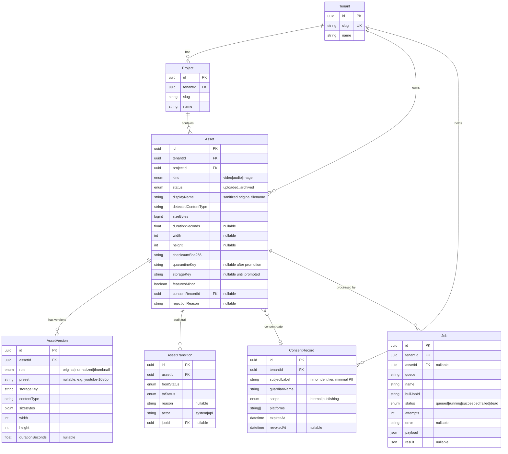
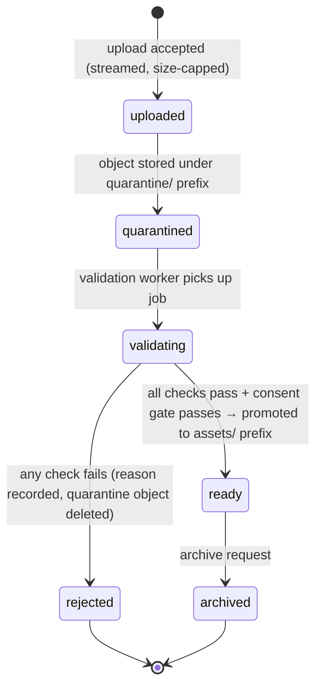

# ADR-AIVS-002 — Asset and Workflow Model

**Status:** Proposed — awaiting user approval (Gate 0 of AIVS-FOUNDATION-002)
**Date:** 2026-07-14
**Deciders:** User + Claude Code
**Related:** ADR-AIVS-001, `docs/security/AIVS-media-security-baseline.md`, `AI_Video_Studio_Foundation_002_Master_Prompt.md`

## Context

AIVS-ENV-001 delivered the toolchain, local infrastructure (Postgres 5433,
Redis 6380, MinIO 9000 via Colima), provider contracts, and media-core
placeholders. FOUNDATION-002 adds the persistent asset model, secure ingestion
pipeline, and job/workflow foundation. Constraints: mocks only (no paid
providers, no publishing, no deployment), no authentication yet but full
tenant scoping from day one, and the media security baseline enforced in code.

## Decision

### 1. Package layout

| Package             | Responsibility                                                                  |
| ------------------- | ------------------------------------------------------------------------------- |
| `packages/database` | Prisma schema, migrations, generated client, seed script (dev tenant + project) |
| `packages/storage`  | `MinioStorageProvider` implementing the existing `StorageProvider` contract     |
| `packages/queue`    | Queue names, BullMQ connection factory, typed job payloads, enqueue helpers     |
| `packages/assets`   | Asset state machine, validators, ingestion/promotion services, consent gate     |
| `apps/worker`       | BullMQ processors for both queues (replaces `aivs-test` smoke queue)            |
| `apps/studio-web`   | Asset API routes (Zod-validated) + minimal asset list/status page               |

`packages/media-core` gains real `normalizeVideo` / `generateThumbnail`
implementations (ffmpeg), replacing the ENV-001 placeholders behind unchanged
signatures.

### 2. Data model (Prisma + PostgreSQL)



Notes:

- Every row carries `tenantId`; every service-layer query filters by it.
  Cross-tenant access denied by default. Auth bolts on later without schema
  changes.
- Original filenames never become keys — stored only as `displayName`,
  stripped of control characters and path separators.
- `Job` mirrors BullMQ state into Postgres so job history survives Redis
  flushes and is queryable per asset.
- Consent is a hard FK gate: `featuresMinor = true` without a valid (present,
  unexpired, unrevoked) `ConsentRecord` blocks promotion out of quarantine.

### 3. Asset lifecycle state machine



- Transitions happen **only** through one service function
  (`transitionAsset(assetId, to, ctx)` in `packages/assets`), which validates
  the edge against an allowed-transition map, writes the `AssetTransition`
  audit row, and updates the asset atomically in one Prisma transaction.
  Illegal edges throw.
- `reprocess` re-enqueues validation for `rejected` assets whose quarantine
  object still exists, and media jobs for `ready` assets. It never skips the
  state machine.

Validation checks (in order, fail-fast, each failure = rejection reason):

1. Magic-byte sniff matches the type allowlist (mp4/mov/webm, mp3/aac/wav/flac,
   jpeg/png/webp — no SVG).
2. Detected type matches the claimed kind; mismatch = reject + audit log.
3. ffprobe (video/audio) or image decode succeeds; metadata persisted.
4. Size/duration limits: video ≤ 2 GB / ≤ 15 min, audio ≤ 200 MB, image ≤ 25 MB.
5. Malware scan boundary: `scan` step through a `MalwareScanner` interface;
   local implementation always passes (ClamAV adapter later).
6. Consent gate: `featuresMinor` without valid consent record → **stays
   quarantined** with status `rejected`, reason `consent-missing` (object kept
   until consent arrives or retention deletes it; every other rejection deletes
   the quarantine object).

### 4. Storage key scheme (MinIO, single bucket `aivs-assets`)

```
quarantine/tenant/{tenantId}/project/{projectId}/asset/{assetId}/{uuid}.{ext}
assets/tenant/{tenantId}/project/{projectId}/asset/{assetId}/{versionId}.{ext}
exports/tenant/{tenantId}/...   (reserved, later module)
public/...                      (reserved, later module — CDN only, never direct ACL)
```

- Keys generated server-side (UUIDs); extension derived from **detected** type,
  never client input.
- Path-style addressing against local MinIO; env-var swap moves to R2/S3.
- No public ACLs anywhere. All reads via signed URLs: default 15 min TTL,
  hard max 24 h. Nothing is ever served from `quarantine/`.
- Promotion = server-side copy quarantine→assets, verify checksum, delete
  quarantine object.

### 5. Queue topology (BullMQ, Redis 6380)

| Queue              | Jobs                                                     | Producer                                             | Consumer      |
| ------------------ | -------------------------------------------------------- | ---------------------------------------------------- | ------------- |
| `asset-validation` | `validate-asset`                                         | upload route, reprocess route                        | `apps/worker` |
| `media-processing` | `normalize-video`, `generate-thumbnail`, `inspect-media` | validation processor (on promotion), reprocess route | `apps/worker` |

Policy:

- Retry: 3 attempts, exponential backoff starting at 5 s.
- Dead-letter: after final failure the job is marked `dead` in the `Job` table
  with the error, and the asset (if mid-validation) transitions to `rejected`
  with reason `processing-failed`. Failed BullMQ jobs retained for inspection.
- Idempotency: deterministic BullMQ job IDs (`{jobName}:{assetId}:{attemptEpoch}`
  for enqueue dedupe) and processors that check current asset state before
  acting — re-delivery of a completed job is a no-op.
- Every processor writes `Job` row updates (queued→running→succeeded/failed)
  so pipeline state is queryable without Redis access.

### 6. Media processing jobs

- `inspect-media`: ffprobe metadata persisted onto `Asset` + original
  `AssetVersion` (completes the ENV-001 `inspectMedia` placeholder).
- `normalize-video`: ffmpeg transcode to h264/aac mp4 per platform preset,
  stored as `AssetVersion(role=normalized, preset=...)`.
- `generate-thumbnail`: frame grab (videos) / resized still (images) as webp,
  `AssetVersion(role=thumbnail)`.

Seven platform presets (names stable, values tunable later):

| Preset            | Resolution | FPS | Aspect |
| ----------------- | ---------- | --- | ------ |
| `youtube-1080p`   | 1920×1080  | 30  | 16:9   |
| `youtube-shorts`  | 1080×1920  | 30  | 9:16   |
| `instagram-reels` | 1080×1920  | 30  | 9:16   |
| `instagram-feed`  | 1080×1080  | 30  | 1:1    |
| `facebook-feed`   | 1080×1080  | 30  | 1:1    |
| `tiktok`          | 1080×1920  | 30  | 9:16   |
| `whatsapp-status` | 1080×1920  | 30  | 9:16   |

Normalization runs on demand (per-preset request), not all seven on every
upload — avoids 7× transcode cost per ingest. Thumbnail + inspect always run
on promotion.

### 7. API surface (studio-web route handlers, Zod-validated)

| Route                         | Method | Purpose                                                  |
| ----------------------------- | ------ | -------------------------------------------------------- |
| `/api/assets/upload`          | POST   | Streaming multipart upload → quarantine + validation job |
| `/api/assets`                 | GET    | List assets (tenant + project scoped, paginated)         |
| `/api/assets/{id}`            | GET    | Asset detail incl. versions + transitions                |
| `/api/assets/{id}/status`     | GET    | Lifecycle status + latest job state (polled by UI)       |
| `/api/assets/{id}/reprocess`  | POST   | Re-enqueue validation or media jobs                      |
| `/api/assets/{id}/signed-url` | GET    | Time-limited signed URL for a ready version              |

- Tenant context: explicit `x-aivs-tenant` header (validated against DB) until
  auth exists; seeded dev tenant is the default in local dev. All handlers
  resolve tenant first and scope every query.
- Upload streams to MinIO with a size cap enforced while reading — request
  aborted the moment the cap is crossed, before the body is fully read.
- UI: one minimal page listing assets with status badges, polling
  `/status` — no design work in this module.

## Alternatives considered

| Area           | Alternative                           | Why rejected                                                                   |
| -------------- | ------------------------------------- | ------------------------------------------------------------------------------ |
| State machine  | XState / library                      | One enum + transition map in a service function is enough; fewer deps          |
| Job history    | Redis-only (BullMQ UI)                | History must survive Redis flush; Postgres is source of truth                  |
| Storage layout | Separate buckets per stage            | Single bucket + prefixes is simpler locally and matches R2 later               |
| Upload         | Presigned-PUT direct to MinIO         | Skips server-side streaming cap + magic-byte position; revisit with auth       |
| Normalization  | All 7 presets on every ingest         | 7× transcode cost; on-demand per preset instead                                |
| Consent        | Block upload entirely without consent | Baseline requires quarantine-hold semantics; upload allowed, promotion blocked |

## Consequences

- Prisma migrations become the schema source of truth; `pnpm db:reset &&
pnpm db:migrate` must reproduce from empty.
- `apps/worker` becomes a real multi-queue worker; ENV-001 `aivs-test` smoke
  queue retired (env smoke test updated accordingly).
- Every future module (script, storyboard, generation, publishing) consumes
  assets only in `ready` state via `packages/assets` services — never raw
  storage keys.

## Security implications

- Baseline controls land as code: quarantine-first, magic-byte + ffprobe
  verification, generated keys, no public ACLs, signed-URL-only reads,
  tenant scoping, consent gate blocking promotion.
- Local MinIO/Postgres credentials remain dev-only; no secrets committed.
- Malware scanning is a stubbed boundary (always-pass locally) — flagged as an
  accepted risk until the ClamAV adapter ships (before external uploads).

## Cost implications

- $0 recurring — local infra only, ffmpeg local, no provider calls.
